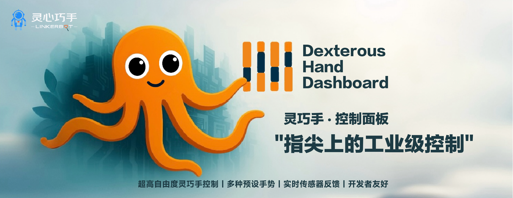

# 🚀 Dexterous Hand Dashboard Project Documentation

[English](README.md)
#### Dexterous hand-operated dashboard for LinkerHand 👋!

## 🎯 Project Overview

**Dexterous Hand Dashboard** is a control dashboard service specifically developed for the LinkerHand dexterous hand device. Built with Golang, it provides a flexible RESTful API interface, enabling finger and palm pose control, execution of preset gestures, real-time sensor data monitoring, and dynamic configuration of hand type (left or right) and CAN interfaces.

## ✨ Features

* **Dynamic Hand Configuration**: Supports dynamic switching between left and right hand types.
* **Flexible Interface Configuration**: Supports various CAN interfaces (such as `can0`, `can1`) configurable through command-line arguments or environment variables.
* **Finger and Palm Pose Control**: Sends finger (6-byte) and palm (4-byte) pose data.
* **Preset Gesture Execution**: Includes numerous predefined gestures such as fist, open hand, pinch, thumbs-up, and numeric gestures.
* **Real-time Animation Control**: Supports dynamic initiation and termination of animations like wave and horizontal sway.
* **Real-time Sensor Data Monitoring**: Provides real-time simulation and updating of pressure data.
* **Health Check and Service Monitoring**: Monitors CAN service status and interface activity in real time.

## 🛠️ API Endpoints

### Hand Type Configuration

* `POST /api/hand-type`

Configure the hand type for a specified interface.

### Finger Pose

* `POST /api/fingers`

Send finger pose data.

### Palm Pose

* `POST /api/palm`

Send palm pose data.

### Preset Gestures

* `POST /api/preset/{pose}`

Execute predefined gestures.

### Animation Control

* `POST /api/animation`

Start or stop animations.

### Sensor Data

* `GET /api/sensors`

Retrieve real-time sensor data for a specified interface or all interfaces.

### System Status

* `GET /api/status`

Query the overall system status, CAN service status, and interface configuration.

### Available Interfaces

* `GET /api/interfaces`

List currently available CAN interfaces.

### Hand Configuration Query

* `GET /api/hand-configs`

Query the hand configuration for all interfaces.

### Health Check

* `GET /api/health`

System health check endpoint.

## ⚙️ Configuration Options

Configuration via command-line arguments or environment variables:

* `CAN_SERVICE_URL` or `-can-url`: URL for the CAN service.
* `WEB_PORT` or `-port`: Web service port.
* `DEFAULT_INTERFACE` or `-interface`: Default CAN interface.
* `CAN_INTERFACES` or `-can-interfaces`: List of available CAN interfaces.

## 💡 Usage Examples

```bash
./control-service -can-interfaces can0,can1,vcan0
CAN_INTERFACES=can0,can1 ./control-service
```

## 🔧 System Requirements

* Golang environment (1.20+)
* CAN communication service

## 🚀 Starting the Service

Launch the control service:

```bash
go run main.go -can-url http://localhost:5260 -port 9099
```

## 📊 Logging and Monitoring

Detailed logs include interface status, gesture execution, and error messages for quick troubleshooting and diagnostics.

## 🤝 Contribution Guidelines

Community developers are welcome to contribute code, report bugs, or suggest features.

## 📄 License

This project is open-sourced under the GPL-3.0 license.
